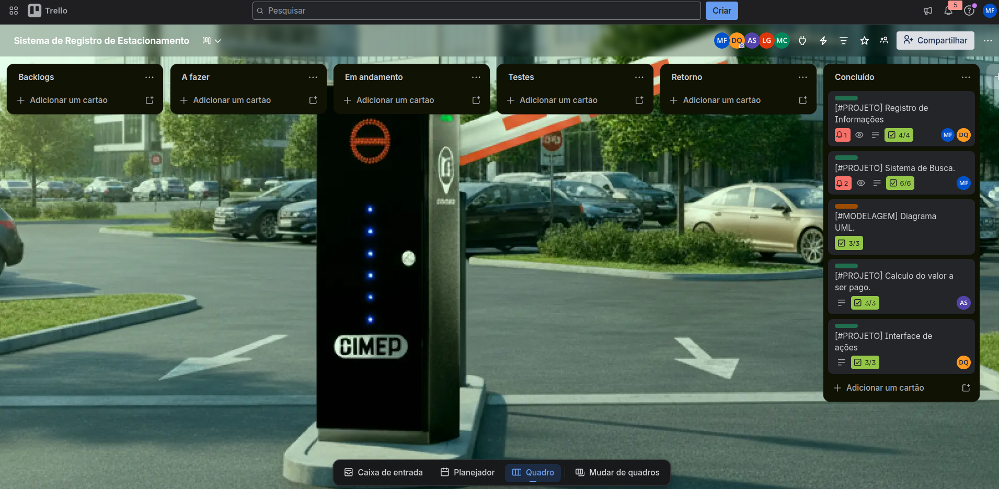
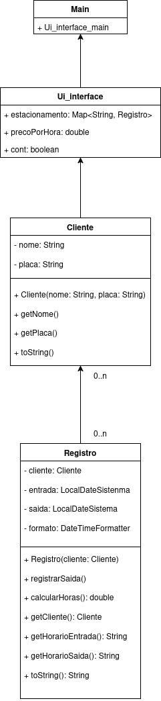
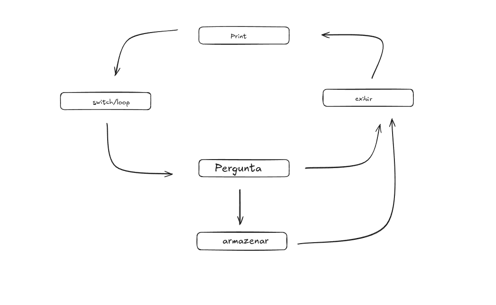

# Sistema de Estacionamento

Sistema de registro de veículos em estacionamento via terminal.

## Funcionalidades

- Registrar entrada e saída de veículos
- Listar veículos no estacionamento
- Buscar veículo por CPF
- Gerar dados de teste
- Cálculo automático do valor por tempo (R$ 0,05/segundo)

## Requisitos

- Java 25
- Gradle

## Como executar

```bash
./gradlew run
```

## Estrutura

```
src/
└── main/java/com/sistema/estacionamento/
    ├── Main.java               # Ponto de entrada
    ├── model/Cliente.java      # Modelo de cliente
    ├── control/Registro.java   # Controle de entrada/saída
    └── view/Ui_interface.java  # Interface do terminal
```

## Imagem do Kanban



> As tarefas e feat foram organizados em um kanban com toda a equipe



> Imagem de UML de classes



> Mini fluxo de funcionamento do sistema